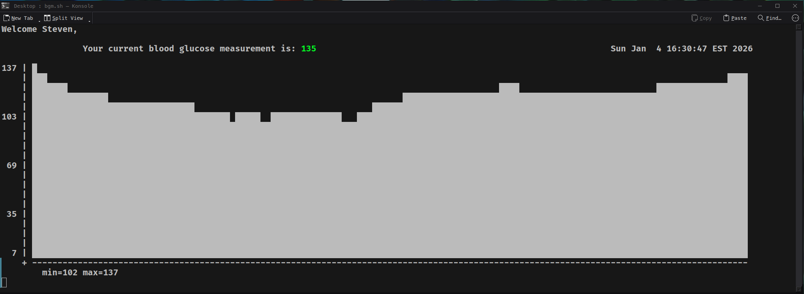

# BashGlucoseMonitor (BGM)

```
 ____            _      _____ _                          __  __             _ _
|  _ \          | |    / ____| |                        |  \/  |           (_) |
| |_) | __ _ ___| |__ | |  __| |_   _  ___ ___  ___  ___| \  / | ___  _ __  _| |_ ___  _ __
|  _ < / _` / __| '_ \| | |_ | | | | |/ __/ _ \/ __|/ _ \ |\/| |/ _ \| '_ \| | __/ _ \| '__|
| |_) | (_| \__ \ | | | |__| | | |_| | (_| (_) \__ \  __/ |  | | (_) | | | | | || (_) | |
|____/ \__,_|___/_| |_|\_____|_|\__,_|\___\___/|___/\___|_|  |_|\___/|_| |_|_|\__\___/|_|
```

> A terminal-based Continuous Glucose Monitor (CGM) viewer using the LibreLinkUp API and your Abbott Libre 3 sensor.

**Version:** 1.5 | **Author:** Pink © 2026

---

## Overview



BGM is a Bash Glucose Monitor script that connects to the [LibreLinkUp API](https://www.librelinkup.com/) using your LibreLinkUp credentials to pull real-time CGM data from your Abbott FreeStyle Libre 3. It then renders an 8-bit style bar graph of your glucose history directly in the terminal and color-codes your current reading based on whether you're in range, high, or low.

---

## Features

- Real-time blood glucose readings pulled from your Libre 3 via the LibreLinkUp API
- Color-coded BG output:
  - <span style="color: green;">**Green**</span> — in range
  - <span style="color: yellow;">**Yellow**</span> — high
  - <span style="color: red;">**Red**</span> — low or null reading

---

## Requirements

- `bash`
- `curl`
- `jq`
- `tput` (part of `ncurses`, typically pre-installed)
- A valid [LibreLinkUp](https://librelinkup.com) account linked to your Libre 3 sensor
  - You must open the LibreLinkUp mobile app at least once to activate the connection before this script can retrieve data

---

## Installation

```bash
git clone https://github.com/sbrohl3/libre3_api
cd bgm
chmod +x bgm.sh
```

---

## Configuration

Create a `config.json` file in the same directory as the script:

```json
{
  "libre_user": "your_libre_link_up@email.com",
  "libre_pass": "your_libre_link_up_password"
}
```

> **Note:** Keep `config.json` private!

---

## Usage

```bash
./bgm.sh
```

The script will:
1. Load credentials from `config.json`
2. Authenticate with the LibreLinkUp API
3. Retrieve your patient connection and graph data
4. Begin polling and rendering your CGM graph on a configurable interval

Press `Ctrl+C` to exit cleanly.

---

## Configuration Options

These variables are set at the top of `bgm.sh`:

| Variable | Default | Description |
|---|---|---|
| `TIME_BETWEEN_MEASUREMENTS` | `60` | Seconds between each graph refresh |
| `RETRY_BEFORE_FAIL` | `5` | Number of failed graph fetches before exiting |
| `SHOW_INFO` | `false` | Print token and patient ID on startup |
| `OBFUSCATE` | `true` | Mask sensitive values with `*` when `SHOW_INFO` is true |

---

## How It Works

1. **Login** — POSTs credentials to `/llu/auth/login` and caches the session in `current_session.json`
2. **Token + User ID** — Extracts the OAuth token and user UUID from the login response
3. **Account ID** — SHA256 hashes the user UUID to generate the `Account-Id` header required by the API
4. **Connection** — GETs `/llu/connections` to retrieve the linked patient profile
5. **Graph** — Polls `/llu/connections/{patientId}/graph` on each iteration to pull fresh glucose history
6. **Plot** — Downsamples the data to fit the terminal width and renders a normalized bar graph row-by-row

---

## Known Limitations

- Requires an active LibreLinkUp connection (the mobile app must be set up and opened at least once)
- Session tokens do expire — delete `current_session.json` if you receive repeated auth errors
- Graph resolution is limited to terminal column width


